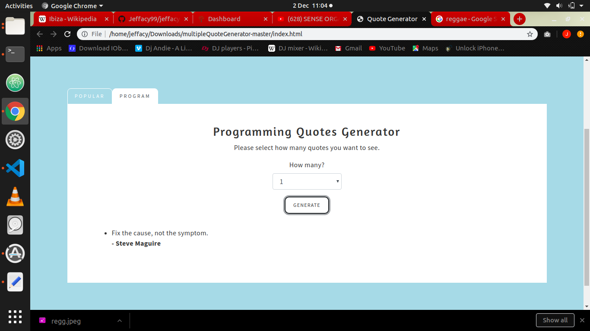

# PROJECT NAME
>QUOTE GENERATOR

## PROJECT DESCRIPTION
>This is an application to generate quotes.

>The live link to the site;https://jeffacy99.github.io/jeffacy-quotes/

## AUTHOR'S INFORMATION
I am a young ambicious youth about programming and looking forward in being the best.Am a student at moringa school.

## SETUP INSTRUCTIONS
>Text editer - I used Visual studio code & atom
>Github account
>Git installed in pc
>Terminal in ubuntu
>Search engine-chrome
>OS-ubuntu

## BDD
This is an application for generating quotes.
  
  
  

## TECHNOLOGIES USED
>Html 5
>CSS
>Bootstrap
>Angular

## CONTACT INFORMATION
For comments,addition information email at japhethmwania99@gmail.com

## LICENSE AND COPYRIGHT
License used is <a href="https://choosealicense.com/licenses/mit/">MIT License</a>  

Copyright (c) **Japheth Mwania (JK Mwania) November 2019**
